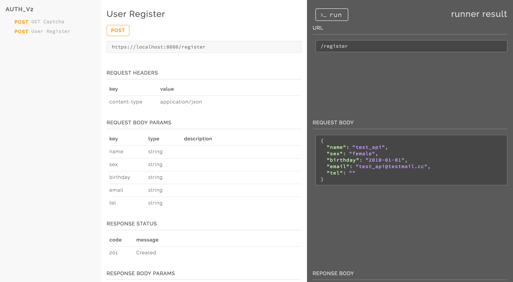

# duckdoc 🦆
[](https://npmjs.org/package/duckdoc)

duckdoc generate static api docmentation site from `.json`  file generated from [duckdoc-jsoner](https://github.com/popodidi/duckdoc-jsoner).

## demo
- [Demo](https://popodidi.github.io/duckdoc/)
- [Tutorial](https://popodidi.haostudio.cc/post/duckdoc-rest-api-documentation/)

## prerequisite

prepare `.json` with [duckdoc-jsoner](https://github.com/popodidi/duckdoc-jsoner).

## install


```
$ npm install --save-dev duckdoc
```

or install globally

```
$ npm install -g duckdoc
```

## usage

### cli

```
$ duckdoc -h

  Usage: duckdoc [options] <jsonDir>

  Options:

    -h, --help                       output usage information
    -o, --output [outputPath]        Output destination, default to ./doc/
    -p, --projectName [projectName]  Output destination, default to folder name


```

### Example

```
$ duckdoc --projectName hello-duckdoc --output ./doc path/to/json/folder 
```

### code

```js
var duckdoc = require('duckdoc');
var duck = duckdoc("projectName", "path/to/json/folder", "/output/path");
duck.renderAll();

```

### Document example

